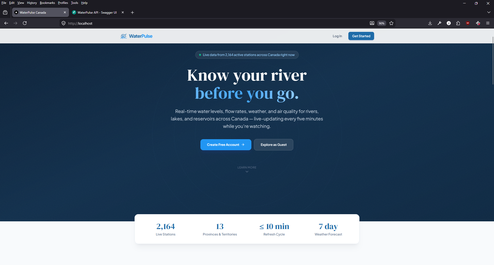
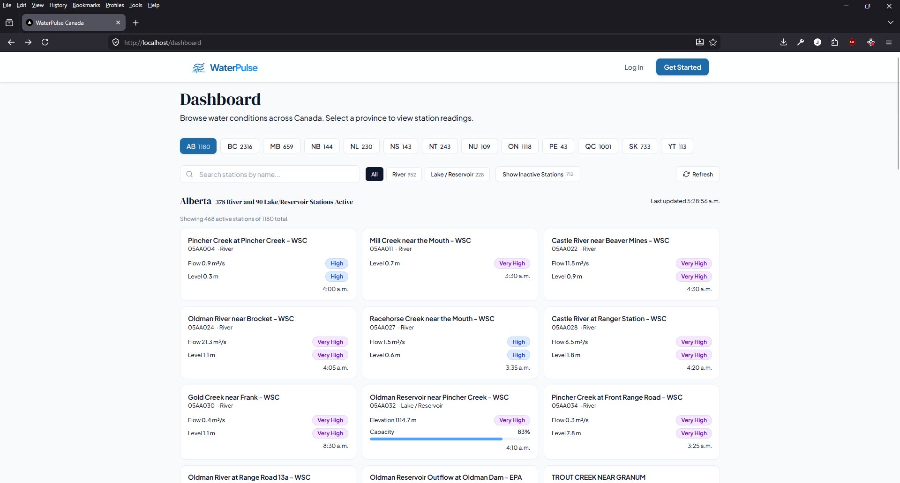

# WaterPulse Canada

Real-time river, lake, and reservoir conditions for anyone visiting Canada's waterways. Built for recreational users (anglers, kayakers, rafters, swimmers) and professionals (fire services, river rescue, field workers, municipal staff).

Covers monitoring stations across all 13 provinces and territories, with water levels, discharge, reservoir capacity, percentile-based ratings, weather forecasts, and air quality data.

## Screenshots

**Landing Page** — live station count, real-time update interval, and coverage stats


**Dashboard** — browse by province, filter by station type, view flow/level readings with percentile ratings


**Search** — find stations by name with results showing current readings and capacity bars


**Station Detail** — current readings, capacity gauge, weather, air quality, 7-day forecast, and station metadata


## Tech Stack

- **Frontend** — Next.js (App Router), JavaScript, Tailwind CSS
- **Backend** — FastAPI, Python 3.12, async SQLAlchemy, PostgreSQL
- **Infrastructure** — Docker Compose (local dev), Kubernetes-ready (kind or cloud)

## Data Sources

| Source | Coverage | API Key |
|---|---|---|
| [ECCC](https://api.weather.gc.ca) (Environment and Climate Change Canada) | All of Canada — hydrometric stations, real-time readings, historical daily means | None |
| [Alberta Rivers](https://rivers.alberta.ca) | Supplementary provincial data — station types, basins, reservoir capacity, precipitation | None |
| [Open-Meteo](https://open-meteo.com) | Weather forecasts, humidity, sunrise/sunset, air quality index | None |

## Quick Start

```bash
# 1. Clone and configure
cp .env.example .env
# Edit .env — set POSTGRES_PASSWORD and SECRET_KEY

# 2. Start all services
docker-compose up --build

# 3. Populate the database (one-time setup)
curl -X POST http://localhost:8000/api/admin/sync-stations
curl -X POST http://localhost:8000/api/admin/refresh-readings

# 4. Open the app
# http://localhost
```

The backend runs Alembic migrations automatically on startup. Readings refresh every 10 minutes via the built-in scheduler.

## Repo Layout

| Directory | Purpose | Details |
|---|---|---|
| [`waterpulse-frontend/`](waterpulse-frontend/README.md) | Next.js app — pages, components, state management | Port 3000 |
| [`waterpulse-backend/`](waterpulse-backend/README.md) | FastAPI app — routes, services, provider architecture | Port 8000 |
| [`k8s/`](k8s/README.md) | Kubernetes manifests for local kind cluster (cloud-portable) | Ingress on port 80 |
| `nginx/` | Reverse proxy config for Docker Compose | Routes `/api/*` to backend, `/*` to frontend |
| `docker-compose.yml` | Container orchestration — db, backend, frontend, nginx | Port 80 |

## Architecture

```
Browser (:80)
  │
  ├── Nginx / K8s Ingress
  │     ├── /api/*  →  Backend (:8000)  →  PostgreSQL (:5432)
  │     │                  │
  │     │                  ├── ECCC API (api.weather.gc.ca)
  │     │                  ├── Alberta API (rivers.alberta.ca)
  │     │                  └── Open-Meteo API (weather + AQI)
  │     │
  │     └── /*      →  Frontend (:3000)
```

## Environment Variables

Copy `.env.example` to `.env` before first run. Two variables require real values:

- `POSTGRES_PASSWORD` — database credential (used by both PostgreSQL and the backend)
- `SECRET_KEY` — JWT signing key (generate with `python -c "import secrets; print(secrets.token_urlsafe(64))"`)

Everything else has sensible defaults. See `.env.example` for the full list.

## Deployment

**Docker Compose** — local development with hot reload. `docker-compose up --build` starts all four services. See each subdirectory's README for detailed setup.

**Kubernetes** — production-ready manifests for a local kind cluster or cloud providers (EKS, GKE, AKS). Historical sync runs as a CronJob instead of an in-process scheduler. See [`k8s/README.md`](k8s/README.md) for the full guide.
