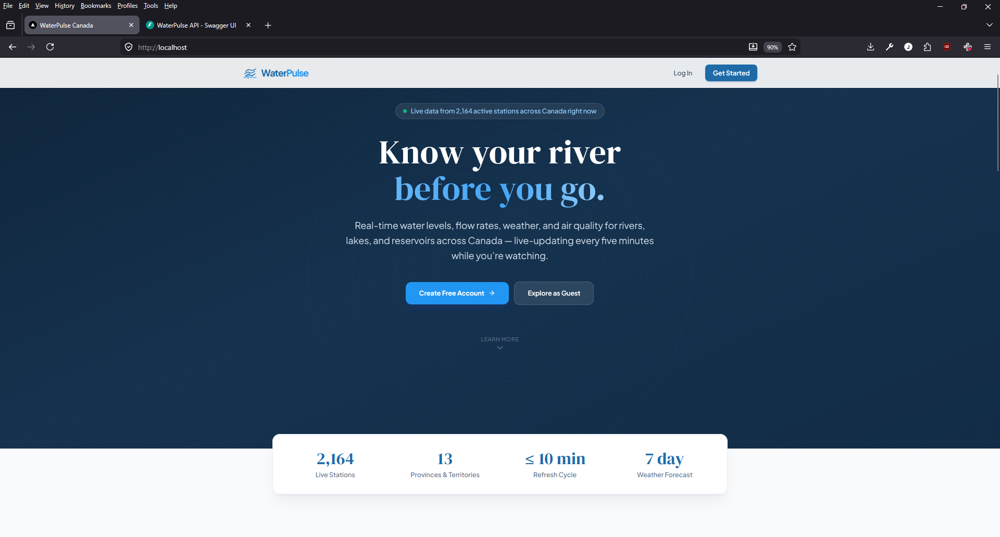
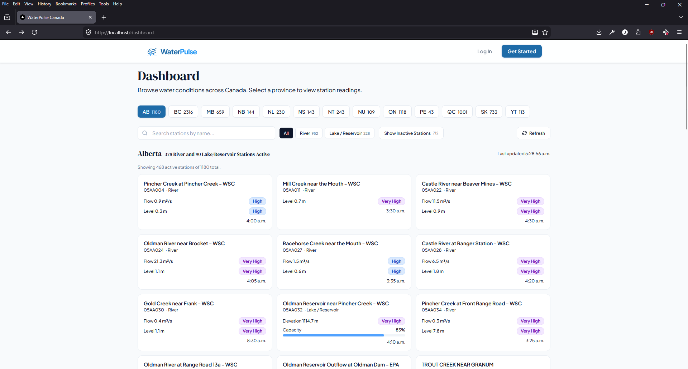

# WaterPulse Canada

Real-time river, lake, and reservoir conditions for anyone visiting Canada's waterways. Built for recreational users (anglers, kayakers, rafters, swimmers) and professionals (fire services, river rescue, field workers, municipal staff).

Covers monitoring stations across all 13 provinces and territories, with water levels, discharge, reservoir capacity, percentile-based ratings, weather forecasts, and air quality data.

## Screenshots

**Landing Page** — live station count, real-time update interval, and coverage stats


**Dashboard** — browse by province, filter by station type, view flow/level readings with percentile ratings


**Search** — find stations by name with results showing current readings and capacity bars


**Interactive Map** — browse stations visually, colour-coded by rating, multi-station selection with aggregated summary


**Station Detail** — current readings, capacity gauge, weather, air quality, 7-day forecast, and station metadata


## Tech Stack

- **Frontend** — Next.js (App Router), JavaScript, Tailwind CSS, MapLibre GL JS
- **Backend** — FastAPI, Python 3.12, async SQLAlchemy, PostgreSQL
- **Basemap** — Self-hosted PMTiles (Protomaps Canada extract) served by Caddy, with a CartoDB Voyager fallback when the local file is absent
- **Infrastructure** — Docker Compose (local dev), Kubernetes-ready (kind or cloud)

## Features

- Real-time water level, discharge, reservoir capacity, weather, and air quality for thousands of monitored stations
- Percentile-based ratings against up to five years of historical norms (very low / low / average / high / very high)
- Interactive MapLibre map with viewport-based loading, province overlay at low zoom, place-name search (Photon), Locate Me with HTTPS-only consent flow, and shareable URL state
- Browse-by-province dashboard with province-scoped search, type filters, and infinite scroll
- Auth-gated **Collections** — owner / editor / viewer roles, share links, tags, public discovery feed, and a Featured surface for admin-curated picks
- HTTPOnly-cookie auth with CSRF protection; `is_admin` flag for superuser actions

## Data Sources

| Source | Coverage | API Key |
|---|---|---|
| [ECCC](https://api.weather.gc.ca) (Environment and Climate Change Canada) | All of Canada — hydrometric stations, real-time readings, historical daily means | None |
| [Alberta Rivers](https://rivers.alberta.ca) | Supplementary provincial data — station types, basins, reservoir capacity, precipitation | None |
| [Open-Meteo](https://open-meteo.com) | Weather forecasts, humidity, sunrise/sunset, air quality index | None |
| [Photon](https://photon.komoot.io) | Place-name search on the map page (autocomplete over rivers, lakes, cities) | None |
| [Protomaps](https://protomaps.com) | PMTiles basemap source (built nightly; we extract Canada and self-host) | None |

## Quick Start

```bash
# 1. Clone and configure
cp .env.example .env
# Edit .env — set POSTGRES_PASSWORD and SECRET_KEY

# 2. Start all services
docker-compose up --build

# 3. Populate the database (one-time setup)
curl -X POST http://localhost:8000/api/admin/sync-stations
curl -X POST http://localhost:8000/api/admin/refresh-readings

# 4. Open the app
# http://localhost
```

The backend runs Alembic migrations automatically on startup. Readings refresh every 10 minutes via the built-in scheduler.

## Repo Layout

| Directory | Purpose | Details |
|---|---|---|
| [`waterpulse-frontend/`](waterpulse-frontend/README.md) | Next.js app — pages, components, state management | Port 3000 |
| [`waterpulse-backend/`](waterpulse-backend/README.md) | FastAPI app — routes, services, provider architecture | Port 8000 |
| [`tiles/`](tiles/README.md) | Self-hosted PMTiles basemap (gitignored binary; Caddy serves it under `/tiles/*`) | Multi-GB Canada extract |
| `docs/` | Standalone guides — currently [`cloudflare-tunnel.md`](docs/cloudflare-tunnel.md) for ad-hoc HTTPS testing | — |
| [`k8s/`](k8s/README.md) | Kubernetes manifests for local kind cluster (cloud-portable) | Ingress on port 80 |
| `Caddyfile` | Reverse proxy config for Docker Compose | Routes `/api/*` to backend, `/tiles/*` to bind-mounted tiles, `/*` to frontend; automatic TLS on prod |
| `docker-compose.yml` | Container orchestration — db, backend, frontend, caddy | Ports 80, 443 |

## Architecture

```
Browser (:80)
  │
  ├── Caddy / K8s Ingress
  │     ├── /api/*    →  Backend (:8000)  →  PostgreSQL (:5432)
  │     │                    │
  │     │                    ├── ECCC API (api.weather.gc.ca)
  │     │                    ├── Alberta API (rivers.alberta.ca)
  │     │                    └── Open-Meteo API (weather + AQI)
  │     │
  │     ├── /tiles/*  →  bind-mounted tiles/canada.pmtiles (Range-served)
  │     │
  │     └── /*        →  Frontend (:3000)
```

Frontend → Photon (`https://photon.komoot.io`) for place-name search is browser-direct, not proxied through Caddy.

## Environment Variables

Copy `.env.example` to `.env` before first run. Two variables require real values:

- `POSTGRES_PASSWORD` — database credential (used by both PostgreSQL and the backend)
- `SECRET_KEY` — JWT signing key (generate with `python -c "import secrets; print(secrets.token_urlsafe(64))"`)

Everything else has sensible defaults. See `.env.example` for the full list.

## Optional: Self-Hosted Basemap

The `/map` page renders fastest when served from a local PMTiles archive. Without one, the frontend falls back to CartoDB Voyager so the page still works — but you don't get the offline-style speed and you do hit a third-party tile server.

```
# 1. Install go-pmtiles (https://github.com/protomaps/go-pmtiles/releases)
# 2. Extract Canada from a recent Protomaps daily build (~5 GB at maxzoom 14)
pmtiles extract https://build.protomaps.com/<YYYYMMDD>.pmtiles tiles/canada.pmtiles \
  --bbox=-141.0,41.5,-52.0,83.5 --maxzoom=14
# 3. Set NEXT_PUBLIC_TILES_URL=/tiles/canada.pmtiles in .env and rebuild the frontend
```

Full instructions in [`tiles/README.md`](tiles/README.md). The binary is gitignored.

## Mobile / Remote Testing

Browser features that the map relies on (geolocation, secure-context APIs) only work over HTTPS, and iOS Safari applies stricter limits to insecure origins. To exercise the app from a phone or another machine, run a Cloudflare Quick Tunnel — outbound connection only, no router config, free temporary HTTPS URL. See [`docs/cloudflare-tunnel.md`](docs/cloudflare-tunnel.md).

## Deployment

**Docker Compose** — local development with hot reload. `docker-compose up --build` starts all four services (db, backend, frontend, caddy). See each subdirectory's README for detailed setup.

**Kubernetes** — production-ready manifests for a local kind cluster or cloud providers (EKS, GKE, AKS). Historical sync runs as a CronJob instead of an in-process scheduler. See [`k8s/README.md`](k8s/README.md) for the full guide.
